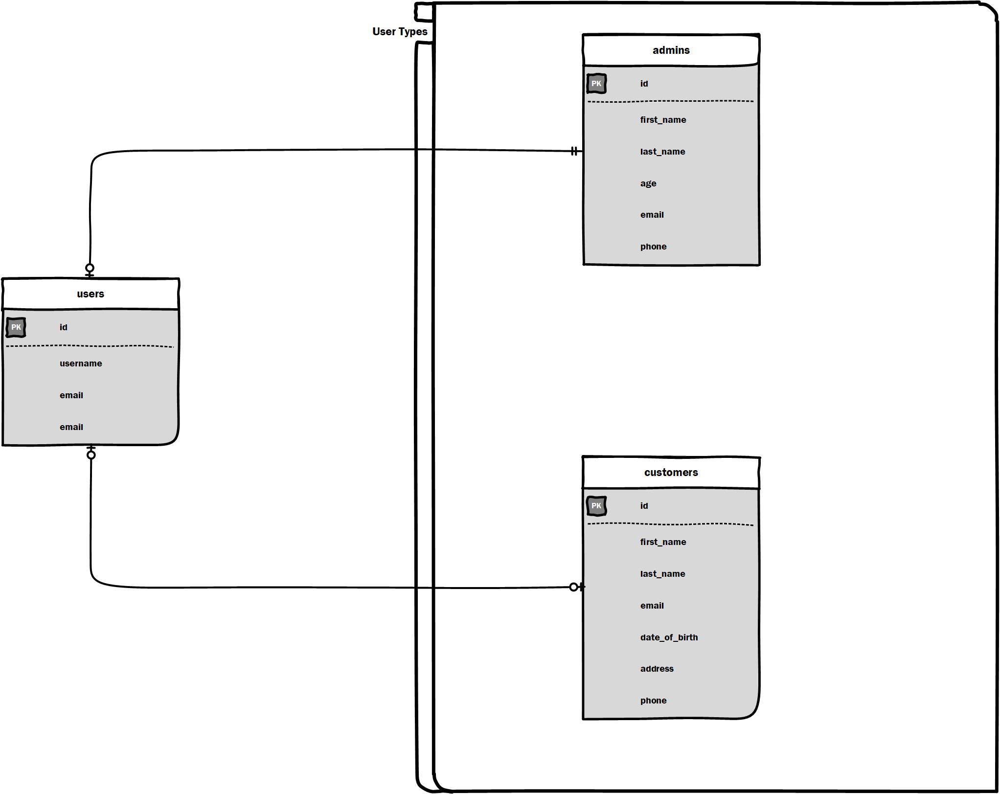

<p align="left"><a href="https://laravel.com" target="_blank"></a></p>


<h1 style="color: #FFD700 ;">Delgont Armor</h1>

<ul>
  <li><a href="#configuration">Armor Configuration</a></li>
  <li><a href="#blade-directives">Blade Directives</a></li>
  <ul>
  <li><a href="#usertype-blade-directive">@usertype Blade Directive</a></li>
  <li><a href="#can-blade-directive">@can Blade Directive</a></li>
  <li><a href="#rolecan-blade-directive">@rolecan Blade Directive</a></li>
  </ul>
  <li><a href="#artisan-commands">Artisan Commands</a></li>

</ul>


<h2 id="configuration">Configuration</h2>


``` config/armor.php ```

<h5 style="color: #FF6347;">Permission Delimiter Configuration</h5>

```php
/**
 * Permission Demiliter
 * Defines the separator for listing multiple permissions in middleware. For example, 
 * setting permission:view-dashboard|edit-settings allows access if the user has
 * either permission.
 */
'permission_delimiter' => '|',
```

<h5 style="color: #FF6347;">Permission Registrars Configuration</h5>

```php
/**
 * Defines an array of classes that statically declare permissions for various user actions within your 
 * application. Each class listed here represents a group 
 * of permissions tied to specific user roles or functionalities.
 */
'permission_registrars' => [
    App\Permissions\ExamplePermissionRegistrar::class,
],
```


<h2 id="blade-directives">Blade Directives</h2>

<h5 style="color: #FF6347;" id="usertype-blade-directive">@usertype Blade Directive</h5>

The @usertype Blade directive allows you to check if the currently authenticated user matches any of the specified user types. This directive can be used to conditionally render content based on the user's type, providing a flexible way to manage permissions and access control in your views.

<h6 style="color: #FF6347;" id="usertype-blade-directive">Usage</h6>

```php
@usertype('userType1|userType2')
    <p>You are authorized to access this section.</p>
@else
    <p>You do not have access to this section.</p>
@endusertype
```

<h6 style="color: #FF6347;" id="can-blade-directive">Usage</h6>

```php
@can('permissionone|permissiontwo')
    <p>You are authorized to access this section.</p>
@else
    <p>You do not have access to this section.</p>
@endcan
```

<h6 style="color: #FF6347;" id="rolecan-blade-directive">Usage</h6>

The @rolecan directive allows you to check if the authenticated user's role has the specified permissions before granting access to a particular section of your Blade view. This directive is particularly useful for managing access control based on user roles and their associated permissions.

```php
@rolecan('permissionone|permissiontwo')
    <p>You are authorized to access this section your role has the necessary permissions.</p>
@elserolecan
    <p>Your role does not have the necessary permission to access this resource</p>
@endrolecan
```


## Laravel Authentication Backend
`Composer` `Laravel Framework 6.0+`

## Introduction

Laravel authentication backend that provides the following features.
- [x] Email or username authentication
- [x] Access control using roles and permissions.
- [x] Access control using roles and permissions.

## Installation

``` composer require delgont/auth ```

``` php artisan vendor:publish  --multiauth-config```

---


## Multi Username Authentication
`username` ` email`

1. Login Controller.
> *Create your custom login controller and use* `Delgont\Auth\Concerns\MultiAuthCredentials` . *this will overide the credentials function*


```
<?php
namespace App\Http\Controllers\Auth;

use App\Http\Controllers\Controller;
use Illuminate\Foundation\Auth\AuthenticatesUsers;
use Delgont\Auth\Concerns\MultiAuthCredentials;
use Illuminate\Http\Request;

class LoginController extends Controller
{
    /*
    |--------------------------------------------------------------------------
    | Login Controller - Multi Authentication using email or username
    |--------------------------------------------------------------------------
    | Use Delgont\Auth\Concerns\MultiAuthCredentials trait
    | You must override the credentials and username functions as shown below
    |
    */
    use AuthenticatesUsers, MultiAuthCredentials;

    /**
     * Where to redirect users after login.
     *
     * @var string
     */
    protected $redirectTo = '/';

    /**
     * Create a new controller instance.
     *
     * @return void
     */
    public function __construct()
    {
        $this->middleware('guest')->except('logout');
    }

    protected function credentials(Request $request)
    {
        return $this->multiAuthCredentials($request);
    }

    public function username()
    {
        return 'username_email';
    }
}
```

2. Your login View.

```php
<input id="username_email" type="text" class="form-control @error('username_email') is-invalid @enderror" name="username_email" value="{{ old('username_email') }}" required autocomplete="username_email" autofocus>
@error('username_email')
  <span class="invalid-feedback" role="alert">
      <strong>{{ $message }}</strong>
  </span>
@enderror
```

---

## Access Control
Regulate access to your laravel systems resources, features and functionality.

### Access control basing on user type



1. add `usertype` & `user_id` columns to your authenticatable migration 

```php
<?php
..............
Schema::table('users', function (Blueprint $table) {
    $table->nullableMorphs('user');
});

```

2. Add `Delgont\Auth\Concerns\HasUserTypes` Trait to user model.

```php
<?php

namespace App;

use Laravel\Passport\HasApiTokens;
use Illuminate\Notifications\Notifiable;
use Illuminate\Contracts\Auth\MustVerifyEmail;
use Illuminate\Foundation\Auth\User as Authenticatable;


use Delgont\Cms\Notifications\Auth\ResetPassword as ResetPasswordNotification;

use Delgont\Auth\Concerns\HasUserTypes;


class User extends Authenticatable
{
    use Notifiable, HasUserTypes, ModelHasPermissions, ModelHasSingleRole;
```

3. Your usertype models

```php
<?php

namespace App;

use Illuminate\Database\Eloquent\Model;

class Customer extends Model
{
    public function user()
    {
        return $this->morphOne('App\User', 'user');
    }
}
```

User can have single role or multiple roles


`Using role middleware to restrict access`

Use `Delgont\Auth\Concerns\ModelHasRoles` trait on your authenticable model

```php
<?php

namespace App;

use Laravel\Passport\HasApiTokens;
use Illuminate\Notifications\Notifiable;
use Illuminate\Contracts\Auth\MustVerifyEmail;
use Illuminate\Foundation\Auth\User as Authenticatable;

use Delgont\Auth\Concerns\ModelHasRoles;

class User extends Authenticatable
{
    /*
    | Use Delgont\Auth\Concerns\ModelHasRoles trait
    |
    */
    use ModelHasRoles;


}

```

> Assigning roles

```php
# Giving role using role names
$model->assignRole(['admin','accountant']);
auth()->user()->assignRole(['admin','accountant']);
```
Protecting routes using the role middleware
```php
Route::get('/test', 'TestController@test')->middleware('role:admin');
Route::get('/test', 'TestController@test')->middleware('role:admin|hello');
```


`Using permission middleware to restrict access`

```php
Route::get('/momo', 'Momo@index')->name('momo')->middleware('permission:access_momo_dashboard');
```

`Configure your default permissions in the permissions configuration file`

```
<?php

return [
    'delimiter' => '|',

    'permissions' => [
      'manage_users',
      'access_momo_dashbaord'
    ]
];
`


```

<h2 id="artisan-commands" style="color: #1E90FF;">Artisan Commands</h2>


> Roles

```cmd
php artisan make:roleRegistrar Roles/ExampleRoleRegistrar
```

```cmd
php artisan role:sync
```

```cmd
php artisan permissions:sync
```

```cmd
php artisan permissions:give-all {userId} Modules\Applicant\Entities\Applicant
```

<div style="border: 1px solid #FFA07A; background-color: #3A3A3A; padding:10px; border-radius:5px; color:#FFF;">
<strong>Note:</strong> User will be able to view total number of students in the dashboard.
</div>
